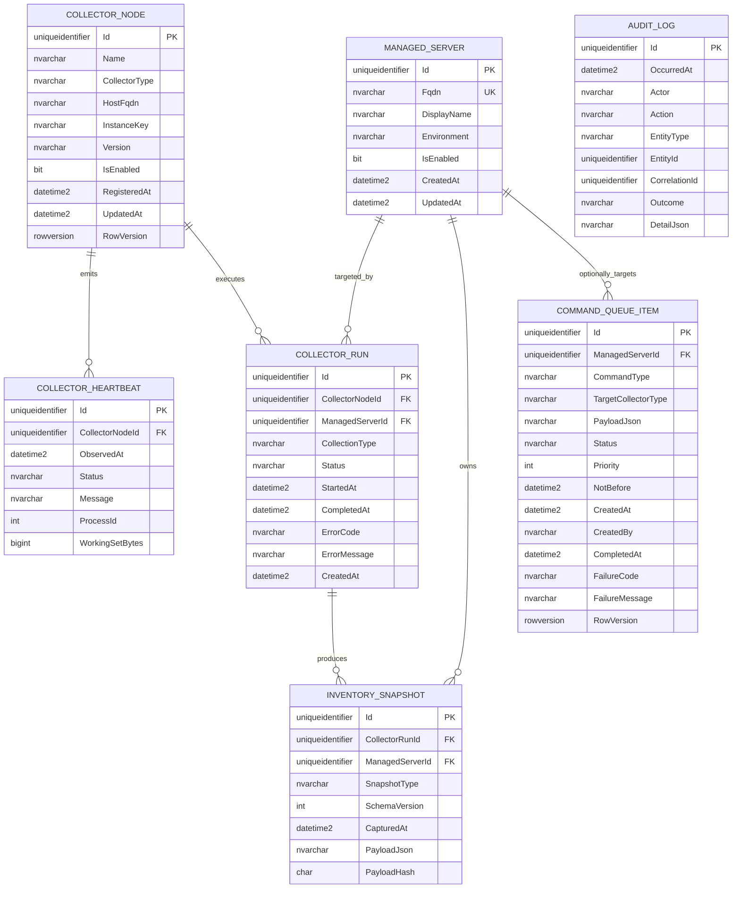

# WP-002 — Core Persistence ER Model

## Purpose

This document defines the initial logical and physical entity-relationship model for WP-002 — Core Persistence Layer.

It is the authoritative database model for the WP-002 implementation. The Work Package remains authoritative for scope, security, testing and completion criteria.

## Scope

The model contains:

- managed Windows server identity,
- collector registration,
- collector heartbeat history,
- collection run history,
- versioned inventory snapshots,
- the initial durable command queue contract,
- append-only audit events.

Collector-specific normalized inventory tables are outside WP-002.

## Logical ER diagram



## Physical schema mapping

| Entity | SQL schema | SQL table |
|---|---|---|
| `ManagedServer` | `configuration` | `ManagedServer` |
| `CollectorNode` | `collection` | `CollectorNode` |
| `CollectorHeartbeat` | `monitoring` | `CollectorHeartbeat` |
| `CollectorRun` | `collection` | `CollectorRun` |
| `InventorySnapshot` | `inventory` | `InventorySnapshot` |
| `CommandQueueItem` | `operations` | `CommandQueueItem` |
| `AuditLog` | `audit` | `AuditLog` |

## Relationships

### CollectorNode to CollectorHeartbeat

- Cardinality: one-to-many.
- Foreign key: `monitoring.CollectorHeartbeat.CollectorNodeId`.
- Delete behavior: restrict.
- Heartbeats are historical operational evidence and SHALL not be cascade deleted with a collector registration.

### CollectorNode to CollectorRun

- Cardinality: one-to-many.
- Foreign key: `collection.CollectorRun.CollectorNodeId`.
- Delete behavior: restrict.
- Collector run history SHALL remain intact when a collector is disabled or decommissioned.

### ManagedServer to CollectorRun

- Cardinality: one-to-many.
- Foreign key: `collection.CollectorRun.ManagedServerId`.
- Delete behavior: restrict.
- Managed servers SHOULD be disabled rather than physically deleted after collection history exists.

### CollectorRun to InventorySnapshot

- Cardinality: one-to-many.
- Foreign key: `inventory.InventorySnapshot.CollectorRunId`.
- Delete behavior: restrict.
- A single run MAY produce multiple versioned snapshot types.

### ManagedServer to InventorySnapshot

- Cardinality: one-to-many.
- Foreign key: `inventory.InventorySnapshot.ManagedServerId`.
- Delete behavior: restrict.
- The direct reference is intentionally denormalized to support efficient server-centric inventory queries.

### ManagedServer to CommandQueueItem

- Cardinality: one-to-many, optional on the command side.
- Foreign key: `operations.CommandQueueItem.ManagedServerId`.
- Delete behavior: restrict when present.
- Platform-wide commands MAY have no managed-server target.

### AuditLog references

`AuditLog.EntityId` is a logical polymorphic reference and SHALL NOT have a database foreign key. This preserves append-only audit evidence even if the referenced domain record is later unavailable.

## Constraints

### Unique constraints

| Name | Table | Columns |
|---|---|---|
| `UX_ManagedServer_Fqdn` | `configuration.ManagedServer` | `Fqdn` |
| `UX_CollectorNode_Registration` | `collection.CollectorNode` | `HostFqdn`, `CollectorType`, `InstanceKey` |
| `UX_InventorySnapshot_RunContract` | `inventory.InventorySnapshot` | `CollectorRunId`, `SnapshotType`, `SchemaVersion` |

### Check constraints

| Name | Table | Expression |
|---|---|---|
| `CK_InventorySnapshot_PayloadJson_IsJson` | `inventory.InventorySnapshot` | `ISJSON([PayloadJson]) = 1` |
| `CK_CommandQueueItem_PayloadJson_IsJson` | `operations.CommandQueueItem` | `ISJSON([PayloadJson]) = 1` |
| `CK_AuditLog_DetailJson_IsJson` | `audit.AuditLog` | `[DetailJson] IS NULL OR ISJSON([DetailJson]) = 1` |
| `CK_InventorySnapshot_SchemaVersion_Positive` | `inventory.InventorySnapshot` | `[SchemaVersion] > 0` |
| `CK_CommandQueueItem_Priority_NonNegative` | `operations.CommandQueueItem` | `[Priority] >= 0` |

Status and type values SHALL be protected primarily by Domain enums and application validation. Database check constraints for enum values MAY be added during implementation when the accepted enum sets are finalized.

## Indexes

| Index | Table | Key columns | Include / purpose |
|---|---|---|---|
| `IX_CollectorHeartbeat_Collector_ObservedAt` | `monitoring.CollectorHeartbeat` | `CollectorNodeId`, `ObservedAt DESC` | Latest heartbeat queries |
| `IX_CollectorRun_Server_CreatedAt` | `collection.CollectorRun` | `ManagedServerId`, `CreatedAt DESC` | Server run history |
| `IX_CollectorRun_Collector_Status_CreatedAt` | `collection.CollectorRun` | `CollectorNodeId`, `Status`, `CreatedAt` | Collector work and diagnostics |
| `IX_InventorySnapshot_Server_Type_CapturedAt` | `inventory.InventorySnapshot` | `ManagedServerId`, `SnapshotType`, `CapturedAt DESC` | Latest inventory by server and type |
| `IX_CommandQueue_Status_Target_Priority` | `operations.CommandQueueItem` | `Status`, `TargetCollectorType`, `Priority`, `NotBefore`, `CreatedAt` | Future queue selection |
| `IX_AuditLog_OccurredAt` | `audit.AuditLog` | `OccurredAt DESC` | Timeline queries |
| `IX_AuditLog_Entity` | `audit.AuditLog` | `EntityType`, `EntityId`, `OccurredAt DESC` | Entity audit history |
| `IX_AuditLog_CorrelationId` | `audit.AuditLog` | `CorrelationId` | Cross-component tracing |

## Delete strategy

WP-002 uses restrictive delete behavior for historical and operational records.

- `ManagedServer` SHALL normally be disabled, not deleted.
- `CollectorNode` SHALL normally be disabled, not deleted.
- Heartbeats, runs, snapshots and audit records are historical records.
- No relationship in WP-002 SHALL use cascade delete.
- A later approved retention Work Package MAY perform controlled deletion of eligible historical records.

## Concurrency model

`CollectorNode.RowVersion` and `CommandQueueItem.RowVersion` SHALL be configured as SQL Server `rowversion` columns.

They SHALL be used for optimistic concurrency only.

WP-002 does not define command leasing semantics. The later queue Work Package SHALL decide whether additional lease-specific concurrency fields and indexes are needed.

## JSON payload strategy

`InventorySnapshot.PayloadJson`, `CommandQueueItem.PayloadJson` and `AuditLog.DetailJson` use SQL Server JSON storage.

Rules:

- JSON must be syntactically valid.
- Payload contracts must have stable names and explicit versions.
- Secrets and credentials must never be stored.
- Frequently queried inventory data SHOULD later receive normalized read models.
- Large raw payload retention SHALL be defined by a later retention Work Package.
- Raw JSON is a durable transport and history format, not an excuse to avoid intentional schema design.

## Naming conventions

- SQL schemas and tables use singular PascalCase names.
- Primary keys use `Id`.
- Foreign keys use `<PrincipalEntity>Id`.
- Unique indexes use `UX_<Table>_<Purpose>`.
- Non-unique indexes use `IX_<Table>_<Purpose>`.
- Check constraints use `CK_<Table>_<Purpose>`.
- Foreign keys use `FK_<Dependent>_<Principal>_<Column>`.
- All EF Core mappings SHALL use Fluent API.

## Migration boundary

The first migration SHALL be named:

```text
InitialCreate
```

It SHALL create:

- the six logical SQL schemas,
- all seven tables,
- primary keys,
- foreign keys,
- unique constraints,
- check constraints,
- indexes,
- rowversion columns.

The migration SHALL NOT:

- seed environment-specific servers,
- seed collector identities,
- create SQL logins,
- grant gMSA permissions,
- run automatically from application startup,
- add collector-specific inventory tables,
- implement queue leasing stored procedures.

## Open implementation notes

The following items may be finalized during implementation without changing the approved conceptual model:

- exact enum member names,
- default SQL constraint names,
- whether application-generated GUIDs use `Guid.NewGuid()` or an approved sequential GUID strategy,
- maximum JSON payload size enforcement outside SQL Server,
- exact namespace and folder layout inside Domain and Infrastructure.

Any change to entity boundaries, relationships, schemas, credential policy, migration policy or queue scope requires documentation review before implementation.
