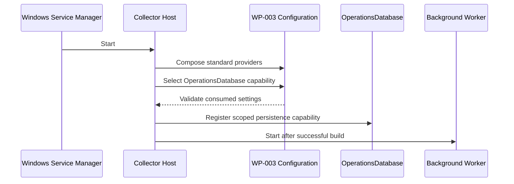
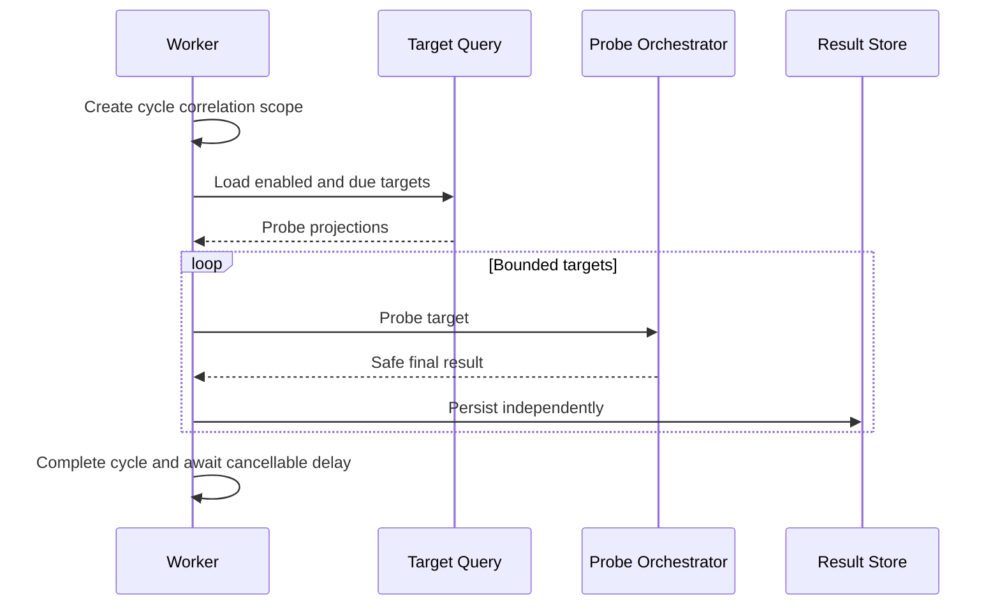
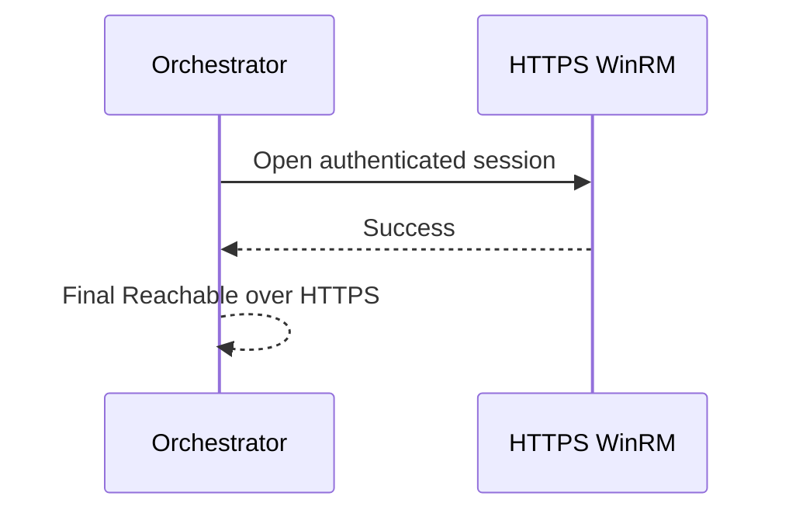
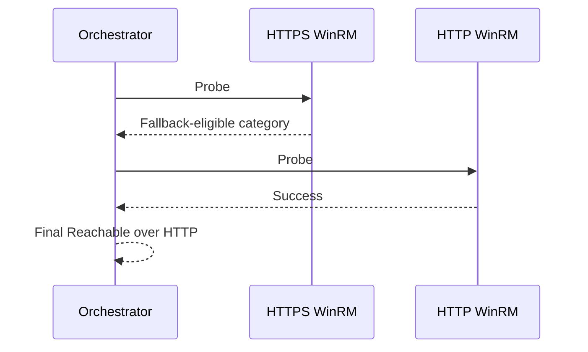
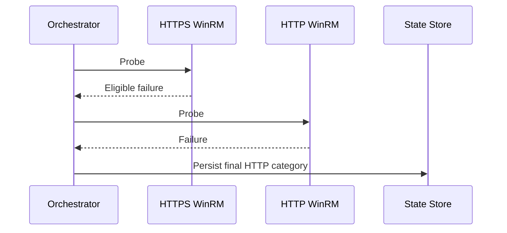
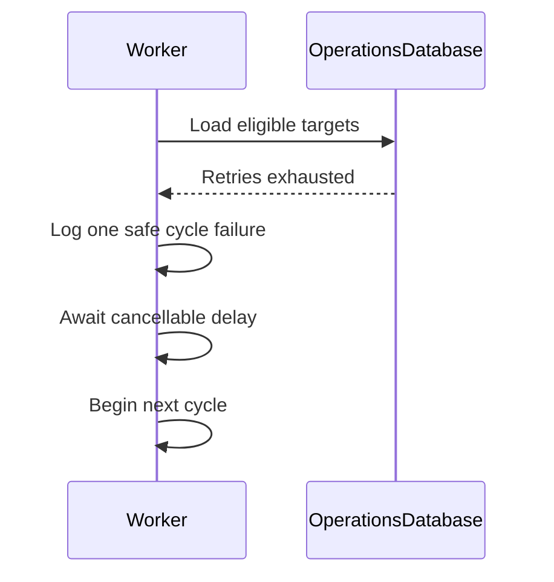
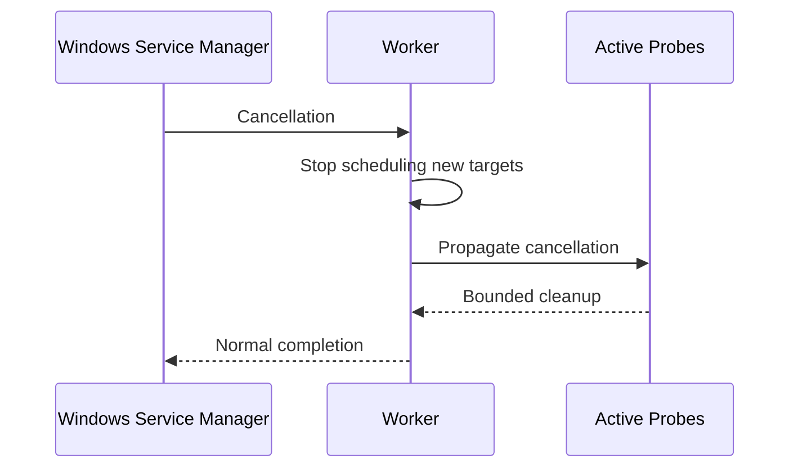

# WP-004 — Windows Collector Architecture

## Purpose

Define the delivered Windows Collector host and orchestration architecture for
WP-004.

WP-004.2 implements the host, configuration/persistence composition, Windows
Service integration, scoped cycle, cancellation and logging foundation.
WP-004.3 implements the scoped, read-only enabled/due target query and immutable
probe-ready projection. WP-004.3A extends that projection with target-specific
transport mode, ports and timeout. WP-004.4 implements the read-only probe and
WP-004.5 independently persists each completed non-cancelled result.

## Scope

WP-004 covers Windows Service hosting, OperationsDatabase-backed target
selection, non-overlapping polling, read-only WinRM connectivity, durable
last-known state and safe recovery. Inventory, Web CRUD, command processing,
remote actions and multi-instance coordination are excluded.

## Component boundary

| Area | Responsibility |
|---|---|
| Domain | Target policy, lifecycle, state and backoff invariants |
| Application | No WP-004-specific code |
| Infrastructure | OperationsDbContext and capability-oriented persistence registration |
| Windows Collector | Host composition, target query/projection, polling, WinRM adapter and result-persistence boundary |
| Collectors.Common | No WP-004 code without a second proven consumer |

The collector MUST NOT expose a command/pipeline API, capture credentials,
modify targets or reference another host project. No plugin, scheduler,
distributed lock, generic repository or public API extension point is added.

## Host startup and configuration

Startup uses the WP-003 provider order and the existing
`AddOperationsDatabaseConfiguration` capability selection. Missing configuration
or SQL Authentication fails fast. DI registers the worker as singleton hosting
infrastructure, `TimeProvider`, immutable options and scoped persistence
dependencies. The worker MUST NOT capture `OperationsDbContext`.

## BackgroundService lifecycle and scopes

One active execution loop awaits each cycle before starting the next. The cycle
scope owns a scoped DbContext used only to materialize an `AsNoTracking` probe
projection; no EF entity or query escapes that boundary. Each completed target
result is persisted in its own fresh scope and short transaction. Network calls never run
inside a database transaction.

## Polling cycle

Eligibility is `IsEnabled = true` and
`NextConnectivityAttemptAt` absent or due. No target is a successful empty
cycle. Bounded concurrency is required for the expected scale; sequential work
can starve later targets, while unbounded `Task.WhenAll` is prohibited. A target
exception is isolated and cannot terminate other target work.

## Transport sequences

### Auto HTTPS success

### Auto HTTPS failure to HTTP success

### Both transports fail

An intermediate HTTPS failure is diagnostic context, not final target state.

## SQL load failure and recovery

Database load failure skips probes for that cycle. Result persistence failures
are isolated per target. Recognized provider retry applies to one SQL operation,
not the entire loop. There is no tight retry.

## Shutdown behavior

Cancellation wins over timeout and HTTP fallback and is not target failure or
an Error log.

## Correlation and assumptions

Each cycle creates one correlation identifier; target logs inherit it. The
proposed initial deployment has one active Windows Collector instance.
Rowversion protects future stale writes but does not provide leasing. WP-004.4
uses at most 20 parallel probes, a 10-second per-transport target timeout and a
20-second combined `Auto` budget.

## Intentionally absent extension points

No multi-instance coordination, distributed scheduler, runtime plugin,
arbitrary command execution, inventory framework, health HTTP endpoint,
OpenTelemetry integration or reusable remote-management SDK is introduced.

## References

- [`../tasks/WP-004-Windows-Collector-Foundation-and-Target-Connectivity.md`](../tasks/WP-004-Windows-Collector-Foundation-and-Target-Connectivity.md)
- [`WP-004-WinRM-Connectivity.md`](WP-004-WinRM-Connectivity.md)
- [`WP-004-Target-State-and-Backoff.md`](WP-004-Target-State-and-Backoff.md)

## Revision history

| Version | Date | Description |
|---|---|---|
| 1.6.0 | 2026-07-27 | Closed WP-004.6 architecture review against the delivered implementation |
| 1.5.0 | 2026-07-27 | Recorded WP-004.5 per-result scopes, state persistence and bounded concurrency retry |
| 1.4.0 | 2026-07-27 | Recorded implemented WP-004.4 probe and bounded orchestration |
| 1.3.0 | 2026-07-27 | Recorded completed WP-004.3A projection/model boundary and resolved WP-004.4 inputs |
| 1.2.0 | 2026-07-27 | Recorded implemented WP-004.3 target selection and eligibility read path |
| 1.1.0 | 2026-07-27 | Recorded implemented WP-004.2 host foundation boundary |
| 1.0.0 | 2026-07-27 | Proposed WP-004 host and orchestration architecture |
