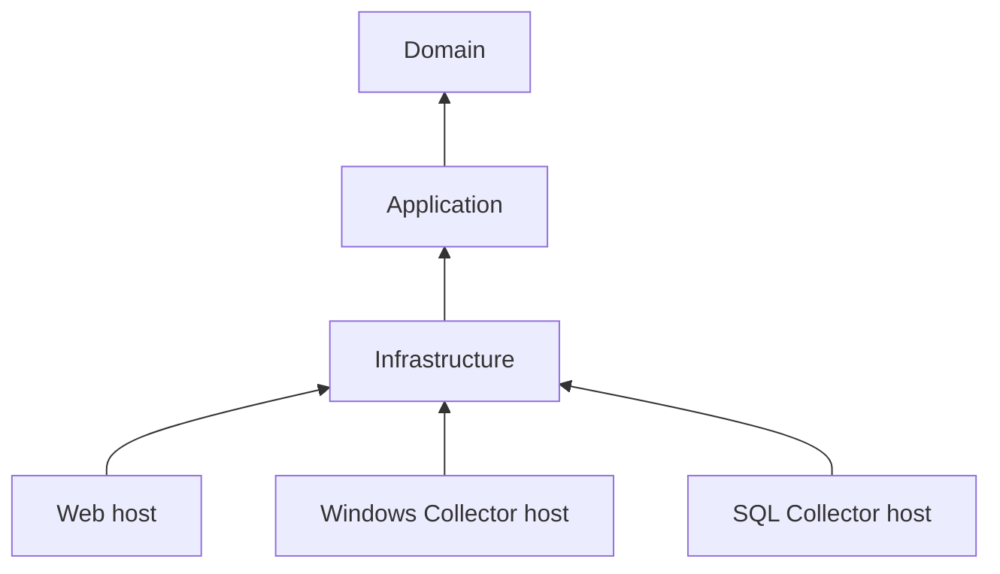
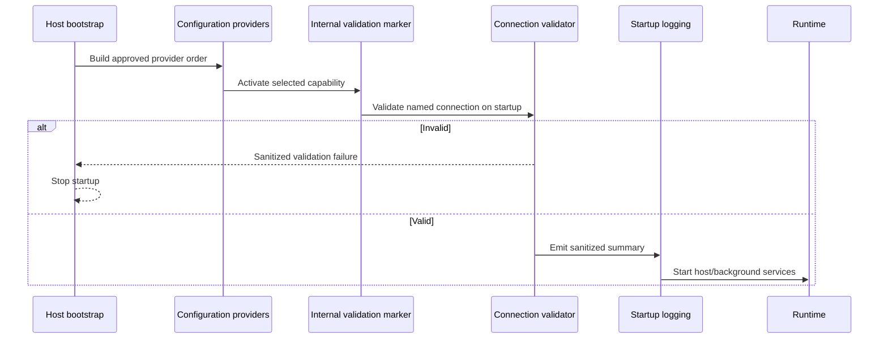

# WP-003 — Configuration Architecture

## Purpose

Define the layers, ownership, dependency direction, provider precedence,
options boundaries and host composition model for WP-003.

## Scope

This document covers startup-time host configuration only. It applies to Web,
Windows Collector, SQL Collector and future worker hosts.

It does not define runtime product configuration, collector behavior,
configuration CRUD, database-backed configuration or secret-vault integration.

## Architecture Principles Applied

- Keep It Simple: use built-in .NET configuration and Options primitives.
- Security by Design: preserve separate Windows and SQL Collector identities.
- One Source of Truth: each value has one effective configuration key.
- No Hidden Magic: provider precedence and host registrations are explicit.
- Small Work Packages: introduce only properties that have an immediate
  consumer.
- Observable by Default: validate and emit a sanitized startup summary.

## Layering and Ownership

| Layer/component | Owns | Must not own |
|---|---|---|
| Domain | Business rules and domain state | Configuration binding, providers, options classes |
| Application | Use-case coordination | Raw `IConfiguration`, provider ordering, host settings |
| Infrastructure | Persistence options, persistence validation and persistence registration | Host provider selection, collector configuration |
| Host | Provider ordering, environment selection, command line, User Secrets activation, selected capability registrations | Other host behavior or identities |
| Collectors.Common | Only genuinely shared collector runtime infrastructure when introduced | Platform-wide configuration framework |

Options belong next to the capability they configure. This prevents a central
“settings” project from reversing dependency direction or becoming a dumping
ground.

## Dependency Direction



Configuration APIs SHALL remain outside Domain. Hosts are composition roots and
MAY depend on the capability projects they compose. Hosts SHALL NOT reference
one another.

## Configuration Source Strategy

### Effective precedence

The approved precedence is listed from lowest to highest:

1. `appsettings.json`
2. `appsettings.{Environment}.json`, as part of the JSON layer
3. User Secrets, only in Development
4. environment variables added with prefix `PSM__`
5. command-line arguments

Later providers win for the same key. Development User Secrets override JSON,
prefixed environment variables override JSON and User Secrets, and command-line
arguments have the highest precedence. This follows standard .NET provider
behavior. No custom precedence mechanism or configuration parser is allowed.

### Prefix mapping

The environment provider SHALL be added with prefix `PSM__`. The provider
removes the prefix, and .NET maps double underscores to configuration path
separators:

```text
PSM__ConnectionStrings__OperationsDatabase
            |
            v
ConnectionStrings:OperationsDatabase
```

An unprefixed `ConnectionStrings__OperationsDatabase` SHALL NOT override PSM
application configuration. Framework-owned host variables using `DOTNET_` or
`ASPNETCORE_` are separate from application options and are not renamed by
WP-003.

The general mapping example
`PSM__SomeSection__SomeValue` becomes `SomeSection:SomeValue` after the prefix
is removed. This example documents standard separator behavior only; it does
not add a runtime option to WP-003.

The standard Microsoft.Extensions.Configuration environment provider SHALL be
used. No custom parser SHALL be written. Environment-variable name casing can
differ between platforms, so deployments SHOULD use the documented casing
consistently and implementation tests SHALL verify the supported host behavior.
Examples SHALL NOT contain real secret values. Exact API use is selected only
after the existing host bootstrap structure is reviewed during implementation.

### Command line

Command-line configuration MAY be supported by all host types because the
standard builders accept arguments. Its values are operationally sensitive and
SHALL NOT be repeated in logs.

### User Secrets

User Secrets SHALL be loaded only when the effective environment is
Development. They are below prefixed environment variables and command line in
precedence. Production SHALL not load the provider even if a secrets identifier
is present. User Secrets are local development storage, not a production secret
management system.

## Configuration Model

WP-003 implements no public strongly typed options model. The connection string
is not an options property, and no other approved `PersistenceOptions` property
has a current consumer. Therefore `PersistenceOptions` is removed from WP-003.
An empty class, placeholder setting or artificial property is prohibited.

The connection string remains at
`ConnectionStrings:OperationsDatabase` and is read using
`IConfiguration.GetConnectionString("OperationsDatabase")` or the equivalent
standard .NET API. It SHALL NOT be copied into another strongly typed options
class.

Connection-string validation SHALL use `SqlConnectionStringBuilder` semantics.
It validates presence and authentication mode only; it does not redefine
WP-002 persistence behavior.

### Deferred candidates

| Options type | Intended purpose | Example property list for WP-003 | Reason deferred |
|---|---|---|---|
| `PlatformOptions` | Truly configurable platform-wide behavior | None | Name, version and environment come from host/runtime; no other consumer exists |
| `CollectorRuntimeOptions` | Collector runtime behavior | None | Collector implementation is out of scope |
| `HeartbeatOptions` | Heartbeat behavior | None | Heartbeat publication is out of scope |
| `CommandQueueOptions` | Command worker/leasing behavior | None | Worker, retry and dead-letter behavior are out of scope |
| `InventoryOptions` | Inventory behavior | None | Inventory collection is out of scope |
| `RetentionOptions` | Retention behavior | None | Retention implementation is out of scope |

This is a deliberate “not yet” decision. Adding placeholder properties would
create unsupported defaults and requirements.

`CommandTimeoutSeconds`, `EnableDetailedErrors`,
`EnableSensitiveDataLogging`, `RetryCount`, `ConnectionTimeout`,
`MigrationTimeout` and `RetentionDays` SHALL NOT be introduced by WP-003.

## Dependency Injection Design

### Decision

Use small capability-oriented extensions rather than one
`AddPlatformConfiguration` extension.

The persistence registration unit SHALL:

- register an internal, property-free capability marker only to participate in
  the standard options validation pipeline;
- register a dedicated validator that reads
  `ConnectionStrings:OperationsDatabase` directly from `IConfiguration`;
- request `ValidateOnStart`;
- register safe post-validation startup diagnostics.

The marker is not a configuration model and carries no connection string or
other configuration value. This approach retains standard `ValidateOnStart`
behavior without creating secret-bearing or placeholder options. A custom
configuration framework is not introduced.

Each host calls only the units it needs. Provider construction remains visible
in host bootstrap code.

### Rationale

- host dependencies remain reviewable;
- unused sections are not loaded or validated;
- future collector settings cannot leak into Web accidentally;
- failure messages remain capability-specific;
- a monolithic extension cannot silently introduce new services into all
  processes.

A private helper MAY remove mechanical duplication, but a public generic
configuration framework is not justified.

### WP-003.1 implementation

`PsmConfigurationExtensions.ConfigurePsmConfiguration` composes the approved
standard providers once and disables reload. Existing executable hosts call the
extension after their standard builder is created.

`OperationsDatabaseServiceCollectionExtensions.AddOperationsDatabaseConfiguration`
registers `IOperationsDatabaseConfiguration`, the internal validation marker,
dedicated validator, `ValidateOnStart` and the internal one-shot startup
diagnostic. The implementation reads the named connection on demand through
`IConfiguration.GetConnectionString`; the diagnostic does not receive, log or
retain the value.

Registration is idempotent. Repeating the extension does not add a duplicate
validator, startup-validation registration or diagnostic hosted service. The
diagnostic also uses a per-instance atomic guard so the same host instance emits
the success event at most once.

WP-003.1 does not register this database capability in production hosts because
they do not yet consume persistence. Provider composition is platform-wide;
database capability registration remains consumer-selected.

## Host Composition

| Host | Current persistence consumer | Capability registration | Connection string required |
|---|---:|---:|---:|
| Web | No | No | No |
| Windows Collector | No | No | No |
| SQL Collector | No | No | No |
| Future Worker | Not defined | No | No |

Current host source contains no `OperationsDbContext`, persistence repository,
persistence service or `OperationsDatabase` consumer. Registration is deferred
to the Work Package that introduces one. A test service provider or minimal
test host SHALL verify the extension, `ValidateOnStart` and diagnostics without
adding unused production host integration.

When a host later selects the capability, its identity and database permissions
remain host-specific. Sharing the registration mechanism does not merge
Windows and SQL Collector security boundaries.

## Startup Lifecycle



No collector loop, request processing or worker execution may begin before
critical configuration validation succeeds.

## Startup Summary Contract

The startup summary SHALL run only when the capability is registered and
validation has succeeded. It SHALL use structured fields and stable field
names. Its allowlist is:

- environment name;
- OperationsDatabase configured: yes;
- authentication mode: Integrated;
- configuration validation succeeded: yes.

It SHALL NOT include configuration values, connection-string fragments, server
names, database names, command-line values or serialized options.

WP-003.3 implements this contract with an internal `IHostedService`. Standard
host startup validation completes before hosted services are started, so the
service cannot emit the success event for invalid configuration. It emits
Information event `2200`, `OperationsDatabaseConfigurationValidated`, without
re-reading configuration or opening a database connection. No timer, polling,
background loop or reload monitoring is introduced.

## Architecture Constraints

- No dynamic reload and no `IOptionsMonitor<T>`.
- No SQL configuration provider.
- No custom configuration database.
- No feature-flag provider.
- No vault provider or vault abstraction in WP-003.
- No cross-host project reference.
- No merging Windows and SQL Collector identities or target permissions.
- No retention, scheduler, retry, dead-letter or notification settings.
- No persistence model, migration, schema or `OperationsDbContext` behavior
  changes.

## WP-002 and WP-003 Boundary

WP-002 owns the EF Core SQL Server provider, `OperationsDbContext`, entity
mappings, schemas, tables, constraints, indexes, migration, SQL Server
persistence behavior, concurrency, persistence exceptions, error mapping and
persistence logging.

WP-003 owns configuration provider composition, named-connection validation,
`ValidateOnStart`, capability-specific registration, prefixed
environment and command-line overrides, Development User Secrets, connection
string presence/authentication-mode validation and safe startup configuration
diagnostics.

“Host startup configuration,” “OperationsDatabase runtime connection
configuration” and “SQL Server persistence configuration” SHALL be used
precisely. WP-003 does not own a SQL configuration database.

## Risks

- Prefix filtering must preserve framework-owned host configuration while
  limiting PSM application environment keys to `PSM__`.
- Future code could expose named connections by binding or serializing the
  complete `ConnectionStrings` section. WP-003 reads only the named connection
  on demand and SHALL NOT serialize configuration.
- Future “shared” options can become accidental coupling between security
  boundaries.
## Open Questions

None.

## References

- [`../tasks/WP-003-Configuration-Management.md`](../tasks/WP-003-Configuration-Management.md)
- [`../project/Principles.md`](../project/Principles.md)
- [`../adr/ADR-001-Pragmatic-Clean-Architecture.md`](../adr/ADR-001-Pragmatic-Clean-Architecture.md)
- [`../adr/ADR-003-Collector-Separation-by-Security-Boundary.md`](../adr/ADR-003-Collector-Separation-by-Security-Boundary.md)
- [`../architecture/Architecture-Baseline-v1.0.md`](../architecture/Architecture-Baseline-v1.0.md)

## Revision History

| Version | Date | Description |
|---|---|---|
| 1.0.0 | 2026-07-26 | Initial architecture with pre-implementation reconciliation |
| 1.0.1 | 2026-07-26 | Removed PersistenceOptions and deferred production host registration |
| 1.0.2 | 2026-07-26 | Recorded WP-003.1 composition and DI implementation |
| 1.0.3 | 2026-07-26 | Recorded WP-003.2 validation implementation |
| 1.0.4 | 2026-07-26 | Recorded WP-003.3 one-shot startup diagnostics implementation |
| 1.0.5 | 2026-07-27 | Closed architecture review against the completed implementation |
