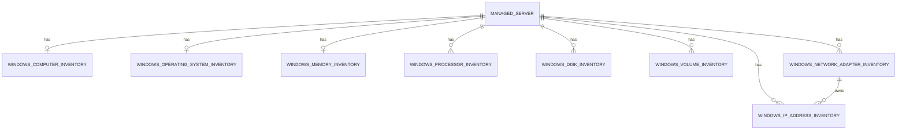

# WP-005 — Inventory Data Model

## Purpose

Define the implemented normalized current state for initial Windows inventory.
WP-005.3 supplies the controlled migration and explicit persistence stores.

The implementation uses application-owned `CapturedAt` in Türkiye local time
through `TimeProvider`. Network persistence is IPv4-only and an IPv4 row has
an explicit restrictive foreign key to its Network Adapter.

## Compatibility decision

`ManagedServer` remains Windows target identity and aggregate root.
`CollectorRun` records execution. Existing `InventorySnapshot` is versioned
run-linked JSON with history-oriented indexes and uniqueness; it is not a
mutable current-state model.

Current snapshot therefore requires new normalized entities. Reusing
`InventorySnapshot` would either append out-of-scope history or mutate a record
designed as run evidence.

## Relationships

All use schema `inventory`, singular PascalCase table names and restrictive
foreign keys. Inventory entities are siblings, not an inheritance chain.

## Common rules

- Required `CapturedAt datetime2(3)` comes from `TimeProvider`; no SQL time
  default.
- Byte quantities are `bigint`; unavailable values are null.
- Empty optional strings normalize to null; enums are constrained strings.
- Plural rows use application-generated GUIDs and unique
  `(ManagedServerId, SourceKey)` semantics.
- Source keys are bounded stable remote identifiers, not display text.
- No credential, arbitrary JSON, command output or history fields.

## Singular entities

### WindowsComputerInventory

Primary/foreign key: `ManagedServerId`.

| Property | SQL | Null |
|---|---|---:|
| `ManagedServerId` | `uniqueidentifier` | No |
| `ComputerName` | `nvarchar(255)` | Yes |
| `Fqdn` | `nvarchar(255)` | Yes |
| `DomainName` | `nvarchar(255)` | Yes |
| `Manufacturer` | `nvarchar(255)` | Yes |
| `Model` | `nvarchar(255)` | Yes |
| `SerialNumber` | `nvarchar(255)` | Yes |
| `CapturedAt` | `datetime2(3)` | No |

DNS/domain values are facts only and never rename, merge or create a
`ManagedServer`. Alias Discovery is separate.

### WindowsOperatingSystemInventory

Primary/foreign key: `ManagedServerId`.

| Property | SQL | Null |
|---|---|---:|
| `ManagedServerId` | `uniqueidentifier` | No |
| `Caption` | `nvarchar(255)` | No |
| `Version` | `nvarchar(100)` | No |
| `BuildNumber` | `nvarchar(50)` | No |
| `Edition` | `nvarchar(100)` | Yes |
| `Architecture` | `nvarchar(50)` | No |
| `InstallDate` | `datetime2(3)` | Yes |
| `LastBootTime` | `datetime2(3)` | Yes |
| `TimeZoneId` | `nvarchar(100)` | Yes |
| `CapturedAt` | `datetime2(3)` | No |

WP-005.4 does not populate `Edition` or `TimeZoneId`; the implemented
projection does not guess those values.

### WindowsMemoryInventory

Initial Memory is singular aggregate capacity, not DIMM inventory.
Primary/foreign key: `ManagedServerId`.

| Property | SQL | Null |
|---|---|---:|
| `ManagedServerId` | `uniqueidentifier` | No |
| `TotalPhysicalMemoryBytes` | `bigint` | No |
| `CapturedAt` | `datetime2(3)` | No |

Byte values are non-negative. DIMM identity/speed/serial is future scope.

## Plural entities

### WindowsProcessorInventory

Source key: `Win32_Processor.DeviceID`, persisted as `StableSourceKey`.
`DeviceID` is the CIM class key and target-local processor identity.

| Property | SQL | Null |
|---|---|---:|
| `Id` | `uniqueidentifier` | No |
| `ManagedServerId` | `uniqueidentifier` | No |
| `StableSourceKey` | `nvarchar(200)` | No |
| `Name` | `nvarchar(255)` | Yes |
| `Manufacturer` | `nvarchar(255)` | Yes |
| `CoreCount` | `int` | Yes |
| `LogicalProcessorCount` | `int` | Yes |
| `MaxClockSpeedMhz` | `int` | Yes |
| `CapturedAt` | `datetime2(3)` | No |

Counts/speed are positive when present. DeviceID is required and unique per
target. SocketDesignation is not persisted because the implemented entity has
no corresponding field.

### WindowsDiskInventory

Disk devices are distinct from filesystem volumes. Source key:
`MSFT_Disk.UniqueId`, persisted as `StableSourceKey`.

| Property | SQL | Null |
|---|---|---:|
| `Id` | `uniqueidentifier` | No |
| `ManagedServerId` | `uniqueidentifier` | No |
| `StableSourceKey` | `nvarchar(260)` | No |
| `DiskNumber` | `int` | Yes |
| `FriendlyName` | `nvarchar(255)` | Yes |
| `SerialNumber` | `nvarchar(255)` | Yes |
| `BusType` | `nvarchar(100)` | Yes |
| `PartitionStyle` | `nvarchar(50)` | Yes |
| `SizeBytes` | `bigint` | Yes |
| `CapturedAt` | `datetime2(3)` | No |

UniqueId is required and unique per target. DiskNumber is mutable display data,
not identity. Serial number is never logged. Size is non-negative.

### WindowsVolumeInventory

Source key: inherited `MSFT_StorageObject.UniqueId`, persisted as
`StableSourceKey`; never DriveLetter.

| Property | SQL | Null |
|---|---|---:|
| `Id` | `uniqueidentifier` | No |
| `ManagedServerId` | `uniqueidentifier` | No |
| `StableSourceKey` | `nvarchar(260)` | No |
| `DriveLetter` | `nvarchar(10)` | Yes |
| `Label` | `nvarchar(255)` | Yes |
| `FileSystem` | `nvarchar(50)` | Yes |
| `SizeBytes` | `bigint` | Yes |
| `FreeSpaceBytes` | `bigint` | Yes |
| `CapturedAt` | `datetime2(3)` | No |

Capacity/free are non-negative; free cannot exceed capacity when both exist.
Disk and Volume have no relationship and use independent replace-all
transactions.

### WindowsNetworkAdapterInventory

Source key: canonical `MSFT_NetAdapter.InterfaceGuid`, persisted as
`StableSourceKey`. InterfaceIndex is transient snapshot correlation only.

| Property | SQL | Null |
|---|---|---:|
| `Id` | `uniqueidentifier` | No |
| `ManagedServerId` | `uniqueidentifier` | No |
| `StableSourceKey` | `nvarchar(200)` | No |
| `Name` | `nvarchar(255)` | Yes |
| `InterfaceDescription` | `nvarchar(500)` | Yes |
| `MacAddress` | `nvarchar(20)` | Yes |
| `OperationalStatus` | `nvarchar(50)` | Yes |
| `LinkSpeedBitsPerSecond` | `bigint` | Yes |
| `CapturedAt` | `datetime2(3)` | No |

InterfaceGuid is required and unique per target. Speed is non-negative.

### WindowsIpv4AddressInventory

Source key is canonical
`(AdapterStableSourceKey, Address, PrefixLength)`.

| Property | SQL | Null |
|---|---|---:|
| `Id` | `uniqueidentifier` | No |
| `ManagedServerId` | `uniqueidentifier` | No |
| `NetworkAdapterInventoryId` | `uniqueidentifier` | No |
| `StableSourceKey` | `nvarchar(300)` | No |
| `Address` | `nvarchar(15)` | No |
| `PrefixLength` | `int` | No |
| `IsDhcp` | `bit` | Yes |
| `CapturedAt` | `datetime2(3)` | No |

Only canonical IPv4 is persisted and prefix is `0..32`. IPv6, AddressFamily,
DNS servers, gateways, routes and aliases are excluded. Adapter FK is required
and restrictive.

## Persistence algorithms

### Singular update

In one short transaction: validate the full result; verify the target is still
enabled/policy-compatible; insert or update every allowlisted field; set one
capture time; commit.

### Plural replace-all

In one short transaction: validate completion and key uniqueness; verify the
target; delete existing target/module rows; insert the complete new set with
one capture time; commit. A valid empty set commits the deletion.

Network Adapter and IP are one coordinated transaction: insert adapters,
resolve address references by interface index, insert IP rows, then commit. If
either result fails, replace neither set.

No transaction spans WinRM. Different module commits are independent.

## Concurrency, indexes and deletes

Persistence reloads `ManagedServer` and applies the WP-004 target projection /
rowversion stale-policy rules. Inventory rows need no rowversion under the
approved single active collector. Multi-instance collection would require a
new decision.

- Singular PK: `ManagedServerId`.
- Plural PK: `Id`.
- Plural unique key: `UX_<Table>_ManagedServer_SourceKey`.
- IP adapter FK index: `IX_WindowsIpAddressInventory_NetworkAdapter`.
- All foreign keys use `DeleteBehavior.Restrict`.

Managed servers are disabled rather than deleted. Explicit replace-all deletion
is current-state mutation, not cascade or history retention.

## Rejected alternatives

- JSON-only current model or updating `InventorySnapshot`;
- one wide table or inheritance hierarchy;
- raw PowerShell/CIM payload storage;
- drive letter/display name as device identity;
- database current time;
- generic repository replacement.

## Implementation validation

WP-005.3 must validate field lengths, EF constraint names and source-key
behavior against representative Windows Server output before migration. A
mismatch requires review; it is not solved with unbounded strings or JSON.

## References

- [`WP-002-Core-Persistence-ER-Model.md`](WP-002-Core-Persistence-ER-Model.md)
- [`../collectors/WP-005-Windows-Inventory-Architecture.md`](../collectors/WP-005-Windows-Inventory-Architecture.md)
- [`../collectors/WP-005-WinRM-Inventory-Orchestration.md`](../collectors/WP-005-WinRM-Inventory-Orchestration.md)

## Revision history

| Version | Date | Description |
|---|---|---|
| 1.0.0 | 2026-07-27 | Defined current Windows inventory model |
