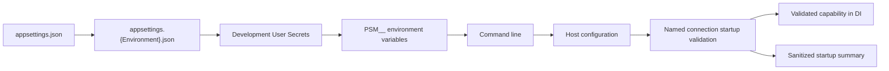

# WP-003 — Configuration Management

## Status

Completed

### Delivery status

WP-003.1 — Configuration Composition, WP-003.2 — Configuration Validation,
WP-003.3 — Safe Startup Diagnostics and WP-003.4 — Final Review are complete.
The implementation, security, documentation and full solution quality gates
passed on 2026-07-27.

WP-003.1 delivered:

- standard JSON, Development User Secrets, `PSM__` environment and command-line
  provider composition;
- approved provider precedence with reload disabled;
- composition integration in Web, Windows Collector and SQL Collector hosts;
- capability-oriented `AddOperationsDatabaseConfiguration` registration;
- on-demand standard named-connection access without validation;
- ten focused composition tests.

WP-003.1 intentionally contains no connection validation, authentication
validation, `ValidateOnStart`, diagnostics, logging or event identifiers.

WP-003.2 delivered:

- internal property-free validation marker;
- dedicated `IValidateOptions<T>` connection validator;
- idempotent `ValidateOnStart` registration through
  `AddOperationsDatabaseConfiguration`;
- presence, SQL syntax and Windows Integrated Authentication validation;
- rejection of SQL credential aliases, including explicitly supplied empty
  values;
- four stable, secret-free failure codes;
- fail-fast, redaction and architecture scope tests.

WP-003.3 delivered:

- an internal one-shot `IHostedService` registered by the existing capability
  extension;
- one structured Information event after successful startup validation;
- event ID `2200` and event name
  `OperationsDatabaseConfigurationValidated`;
- allowlisted environment, configured, authentication-mode and validation
  metadata only;
- idempotent registration and per-host single-emission behavior;
- success, invalid-configuration, redaction, isolation, event-contract and
  architecture tests.

WP-003.3 contains no production-host capability registration, connection
probing, runtime monitoring, reload behavior or new validation rule.

## Purpose

Define the common, fail-fast configuration foundation that Web, Windows
Collector, SQL Collector and future worker hosts will use. WP-003 standardizes
configuration sources, named-connection access, validation, registration and
safe startup diagnostics. It does not implement business or collector behavior.

## Scope

WP-003 implementation SHALL:

- use standard .NET configuration primitives;
- use `PSM__` as the application environment-variable prefix;
- bind only configuration required by a host;
- validate the named operations database connection without binding it to an
  options property;
- validate required configuration during startup;
- reject SQL Authentication;
- support Development User Secrets;
- emit a sanitized startup configuration summary;
- provide small registration units that hosts compose explicitly;
- define automated verification for binding, precedence, validation, security
  and dependency boundaries;
- preserve the completed WP-002 persistence model and behavior.

The configuration model is local to each process. Configuration is read at
startup and remains fixed for the process lifetime.

## Out of Scope

The following are explicitly out of scope:

- Dynamic reload
- `IOptionsMonitor<T>`
- Collector implementation
- Scheduler
- Retry
- Dead-letter behavior
- Notification
- Configuration CRUD
- Configuration database
- Feature flags
- KeyVault
- CyberArk
- Azure App Configuration
- Runtime configuration changes
- SQL-backed configuration
- Vault integration
- Worker implementation
- Web configuration CRUD
- Retention settings
- New projects, packages, migrations or database objects
- Persistence model, schema, migration or `OperationsDbContext` changes

## Architecture Overview

Configuration is a host-composition responsibility. Infrastructure may own
options and validators for infrastructure capabilities, but it SHALL NOT select
configuration providers or know which hosts consume those capabilities.



The dependency direction remains:

```text
Domain <- Application <- Infrastructure <- Host composition
```

- Domain SHALL NOT depend on configuration APIs or options.
- Application SHALL NOT select providers or read raw configuration.
- Infrastructure MAY own the operations database configuration validator and
  capability registration because it owns SQL persistence.
- Each host owns provider ordering and selects only the registration units it
  requires.
- Host projects SHALL NOT reference one another.
- `Collectors.Common` SHALL NOT become a general configuration framework.

## Design Decisions

1. Standard .NET configuration and Options APIs SHALL be used. No custom
   configuration framework is introduced.
2. Application environment variables SHALL use the `PSM__` prefix. With the
   prefix removed by the provider, double underscores map to section
   separators. Example:
   `PSM__ConnectionStrings__OperationsDatabase`.
3. Effective application-value precedence, lowest to highest, SHALL be:
   `appsettings.json`, `appsettings.{Environment}.json`, Development User
   Secrets, `PSM__`-prefixed environment variables, then command-line
   arguments.
4. User Secrets SHALL be added only when the effective host environment is
   Development. They SHALL NOT be added in Production.
5. Unprefixed environment variables SHALL NOT be accepted as an application
   configuration bypass. Framework host settings such as `DOTNET_` or
   `ASPNETCORE_` remain framework concerns and are not PSM application keys.
6. Configuration SHALL be immutable after startup. Dynamic reload and
   `IOptionsMonitor<T>` are prohibited in this work package.
7. Persistence configuration SHALL use the standard `ConnectionStrings`
   section and the key `OperationsDatabase`.
8. SQL connectivity SHALL use Windows Integrated Authentication. SQL
   Authentication SHALL fail startup validation.
9. WP-003 SHALL NOT require `Encrypt=True` or
   `TrustServerCertificate=False`. This is an approved, deliberate decision.
10. Startup logs SHALL record configuration state, not secret values.
11. No public configuration options model SHALL be implemented until a real,
    documented property consumer exists.
12. Standard .NET provider precedence SHALL be used. No custom precedence
    mechanism or configuration parser SHALL be introduced.

### Documentation reconciliation

The Architecture Baseline's former “WP-003 — Database Foundation” name has been
replaced by “WP-003 — Configuration Management.” Database foundation was
completed by WP-002.

The former ADR-006 prerequisite was removed because no ADR-006 exists in the
repository and its listed database-design subjects are already defined by the
completed WP-002 task, ER model, migration and SQL Server validation evidence.
No new ADR was created solely to fill the number.

## Configuration Model

WP-003 contains no public strongly typed options model. After removing the
connection string, no real, documented `PersistenceOptions` property remains.
An empty `PersistenceOptions`, placeholder property or artificial setting SHALL
NOT be introduced merely to satisfy an acceptance criterion.

`ConnectionStrings:OperationsDatabase` is read through the standard
`IConfiguration.GetConnectionString("OperationsDatabase")` mechanism or its
equivalent. It SHALL NOT be copied into `PersistenceOptions`, another options
class or an internal marker property.

The following candidate groups SHALL NOT be implemented in WP-003 because no
current behavior consumes their settings:

| Candidate | Intended responsibility | WP-003 property list | Decision |
|---|---|---|---|
| `PlatformOptions` | Platform-wide values not supplied by host/runtime metadata | None | Deferred; application name, version and environment are already runtime metadata |
| `CollectorRuntimeOptions` | Collector loop and instance behavior | None | Deferred with collector implementation |
| `HeartbeatOptions` | Heartbeat publication behavior | None | Deferred with heartbeat implementation |
| `CommandQueueOptions` | Leasing and command worker behavior | None | Deferred with queue worker implementation |
| `InventoryOptions` | Inventory collection behavior | None | Deferred with inventory implementation |
| `RetentionOptions` | Retention behavior | None | Deferred with retention implementation |

`CommandTimeoutSeconds`, `EnableDetailedErrors`,
`EnableSensitiveDataLogging`, `RetryCount`, `ConnectionTimeout`,
`MigrationTimeout` and `RetentionDays` are not approved WP-003 properties.
No retention, scheduler, retry, dead-letter or notification properties SHALL be
added speculatively.

## Validation Strategy

Validation is detailed in
[`../configuration/WP-003-Configuration-Validation.md`](../configuration/WP-003-Configuration-Validation.md).

The implementation SHALL use the standard options startup-validation pipeline
without putting the connection string in an options property:

- an internal, property-free capability marker participates only in the
  standard `ValidateOnStart` pipeline and is not a configuration model;
- a dedicated validator reads `ConnectionStrings:OperationsDatabase` directly
  from `IConfiguration`;
- the connection string is parsed locally and is never stored on the marker;
- startup validation prevents a host that selected the capability from becoming
  ready or starting background work.

The validator SHALL use `SqlConnectionStringBuilder` semantics so aliases and
equivalent keywords are normalized. `User ID`, `UID`, `Password` and `PWD` are
forbidden.

DataAnnotations do not apply in WP-003 because there is no approved options
property. Strongly typed options and their DataAnnotations validation move to
the future Work Package that introduces a real property consumer.

Validation failures SHALL identify the section and stable rule, but SHALL NOT
include the connection string or credential values.

## Dependency Injection Strategy

One large `AddPlatformConfiguration` extension is rejected because it would
load every section into every host and hide dependencies.

Small capability-oriented registration units SHALL be used. A host explicitly
adds only what it consumes. An `AddOperationsDatabaseConfiguration`-style unit
registers the internal validation marker, dedicated connection validator,
`ValidateOnStart` and safe startup diagnostics. It does not bind the connection
string or register unrelated persistence behavior. Provider ordering remains in
host bootstrap code because it is a host concern.

The implementation MAY use a small shared helper for repeated safe mechanics,
but SHALL NOT expose a generic options-registration framework.

The precise standard Microsoft.Extensions.Configuration API calls SHALL be
chosen after reviewing the existing Web and generic host bootstrap code during
implementation. No custom parser is authorized.

## Host Configuration Matrix

| Host | Current persistence consumer | WP-003 registration | Connection string required |
|---|---:|---:|---:|
| Web | No | No | No |
| Windows Collector | No | No | No |
| SQL Collector | No | No | No |
| Future Worker | Not defined | No | No |

No current executable host consumes `OperationsDbContext`, a persistence
repository, a persistence service or the `OperationsDatabase` connection.
Production host integration is deferred to the Work Package that introduces
such a consumer. Capability behavior SHALL be verified with a test service
provider or minimal test host; unused production registration is prohibited.

The Windows and SQL Collector hosts SHALL remain separately deployable and
SHALL run under different identities. Sharing configuration mechanics does not
merge permissions or identities.

## Security Considerations

Security is detailed in
[`../configuration/WP-003-Configuration-Security.md`](../configuration/WP-003-Configuration-Security.md).

- Connection strings SHALL NOT contain usernames or passwords.
- SQL Authentication aliases SHALL be detected and rejected.
- Full or partially redacted connection strings SHALL NOT be logged; omission
  is safer than redaction.
- User Secrets are a Development convenience, not a Production secret store.
- Repository JSON SHALL contain no environment-specific sensitive values.
- Environment variables are process-readable configuration and SHALL NOT be
  treated as a vault.
- A future secret provider MAY be inserted as another host-owned configuration
  source before binding. No provider contract or vault implementation is
  introduced now.

## Startup Diagnostics

Only a host that calls the operations database capability registration SHALL
log one structured summary, and only after validation succeeds.

The implemented diagnostic is an internal one-shot `IHostedService`. The
standard host runs options startup validation before starting hosted services,
so an invalid capability configuration prevents the success event. The service
does not receive `IConfiguration`, the named-connection accessor or a parsed
connection-string object, and therefore does not retain connection data.

The single event is Information-level event ID `2200`, named
`OperationsDatabaseConfigurationValidated`. Repeated capability registration is
blocked by the existing registration sentinel and enumerable registration; an
additional per-instance atomic guard prevents repeat emission by the same
diagnostic service.

Allowed fields:

- environment name;
- OperationsDatabase configured: yes;
- authentication mode: Integrated;
- configuration validation succeeded: yes.

Prohibited fields:

- full or partial connection strings;
- server or database names;
- usernames, passwords or authentication material;
- raw environment-variable values;
- User Secrets identifiers or values;
- command-line values;
- serialized options objects.

Example:

```text
Configuration startup summary:
Environment=Production,
OperationsDatabaseConfigured=True,
AuthenticationMode=Integrated,
ConfigurationValidationSucceeded=True
```

## Testing Strategy

### Unit tests

- valid Windows Integrated connection strings pass;
- missing and malformed connection strings fail;
- `User ID`, `UID`, `Password`, `Pwd` and explicit SQL-password modes fail;
- `Integrated Security=True` and `Trusted_Connection=True` aliases pass;
- conflicting authentication keywords fail;
- absence of `Encrypt=True` passes;
- `TrustServerCertificate=True` passes because no certificate-policy
  requirement is introduced;
- validation messages never contain input connection-string values.

### Integration tests

- provider precedence matches JSON, environment JSON, Development User Secrets,
  prefixed environment variables and command line, in that order;
- `PSM__ConnectionStrings__OperationsDatabase` overrides JSON and Development
  User Secrets;
- command line overrides prefixed environment variables;
- Development User Secrets override both JSON sources but remain below
  environment variables and command line;
- User Secrets are absent outside Development;
- `PSM__SomeSection__SomeValue` maps to `SomeSection:SomeValue` in a
  mapping-only test and does not create an options model;
- prefix behavior is verified with platform casing differences considered;
- invalid configuration fails the minimal test host startup before hosted work
  executes;
- a host without the capability starts without OperationsDatabase;
- only a service provider that registers the capability validates the named
  connection.

### Architecture tests

- Domain and Application do not depend on configuration/Options packages;
- host projects do not reference one another;
- collector identity boundaries are unchanged;
- there is no SQL configuration provider, custom dynamic provider or
  `IOptionsMonitor<T>` usage;
- registration remains capability-oriented.

### Acceptance tests

- sanitized startup summary is emitted only by the capability-enabled test
  host after successful validation;
- current production hosts emit no persistence summary;
- no secret is present in startup or validation logs;
- Production startup does not load User Secrets;
- SQL Authentication causes startup failure;
- no collector, worker or Web CRUD behavior is introduced;
- release build and the complete automated test suite are defined as the
  implementation completion gate;
- formatting and dependency-boundary checks pass.

WP-003.4 completed the Release build and full automated suite on 2026-07-27:
121 tests passed with zero failures, warnings or build errors. Formatting,
dependency vulnerability and diff-integrity checks also passed.

## Acceptance Criteria

| # | Criterion | Result | Evidence |
|---:|---|---|---|
| 1 | Configuration provider composition is implemented | PASS | `PsmConfigurationExtensions.ConfigurePsmConfiguration` |
| 2 | Provider precedence uses the approved order | PASS | `ConfigurePsmConfiguration_AppliesProvidersInApprovedOrder` |
| 3 | Development User Secrets are Development-only | PASS | `ConfigurePsmConfiguration_DoesNotAddUserSecretsOutsideDevelopment` |
| 4 | The `PSM__` prefix is supported | PASS | `ConfigurePsmConfiguration_PrefixedEnvironmentVariableMapsToSection` |
| 5 | `PSM__ConnectionStrings__OperationsDatabase` maps correctly | PASS | `ConfigurePsmConfiguration_PrefixedOperationsDatabaseMapsToNamedConnection` |
| 6 | Command line has highest precedence | PASS | Full provider-order composition test |
| 7 | OperationsDatabase uses the standard `ConnectionStrings` section | PASS | `OperationsDatabaseConfiguration.GetConnectionString` |
| 8 | No options model stores the connection string | PASS | Property-free marker and `ConfigurationValidation_DoesNotCreatePersistenceOptions` |
| 9 | Missing, empty and whitespace values are rejected | PASS | `OperationsDatabaseValidation_RejectsMissingValues` |
| 10 | Malformed values are rejected safely | PASS | `ConnectionStringValidation_RejectsMalformedValuesSafely` |
| 11 | SQL semantics use `SqlConnectionStringBuilder` | PASS | `OperationsDatabaseConfigurationValidator` |
| 12 | Windows Integrated Authentication is accepted | PASS | `IntegratedAuthentication_AcceptsSupportedSemanticForms` |
| 13 | SQL Authentication is rejected | PASS | `SqlAuthentication_RejectsCredentialKeys` |
| 14 | `User ID`, `UID`, `Password` and `PWD` are rejected | PASS | Credential-alias theory cases |
| 15 | Empty credential keys cannot bypass validation | PASS | Empty `User ID` and `Password` theory cases |
| 16 | No `Encrypt` policy is imposed | PASS | `ConnectionStringValidation_DoesNotImposeEncryptionPolicy` |
| 17 | No `TrustServerCertificate` policy is imposed | PASS | `ConnectionStringValidation_DoesNotImposeEncryptionPolicy` |
| 18 | Validation fails fast during startup | PASS | `ValidateOnStart_RejectsInvalidConfiguration` |
| 19 | Hosts without the capability are unaffected | PASS | `ValidateOnStart_DoesNotAffectHostWithoutCapability` |
| 20 | Capability registration is idempotent | PASS | `AddOperationsDatabaseConfiguration_IsIdempotent` |
| 21 | Diagnostics run only after validation | PASS | Invalid-configuration diagnostic theory cases |
| 22 | Startup diagnostics emit exactly once | PASS | `StartupDiagnostics_LogsAllowlistedSummaryOnce` |
| 23 | Diagnostics use an allowlist | PASS | Structured-state key assertion in diagnostics tests |
| 24 | Connection and endpoint details are not logged | PASS | Diagnostics sentinel redaction tests |
| 25 | Validation failures contain no sensitive value | PASS | `ConfigurationRedaction_FailuresContainOnlyStableCode` |
| 26 | Event ID is unique and documented | PASS | Event `2200`; `ConfigurationEventId_IsStableAndDoesNotOverlapPersistenceRange` |
| 27 | Runtime reload is absent | PASS | Architecture source scan; no `IOptionsMonitor` or timer |
| 28 | SQL-backed configuration is absent | PASS | Configuration source and dependency review |
| 29 | Vault integration is absent | PASS | Package, source and abstraction review |
| 30 | Production hosts have no unnecessary capability registration | PASS | `ConfigurationValidation_IsNotRegisteredByProductionHosts` |
| 31 | No migration or schema change was introduced | PASS | WP-003 diff and architecture scan |
| 32 | No collector or Web CRUD implementation was introduced | PASS | WP-003 diff and scope review |
| 33 | Full test suite succeeds | PASS | 121/121 tests passed on 2026-07-27 |
| 34 | Release build is clean | PASS | 0 warnings and 0 errors |
| 35 | Formatting is clean | PASS | `dotnet format --verify-no-changes` |
| 36 | No vulnerable package is reported | PASS | NuGet transitive vulnerability audit |
| 37 | Documentation matches implementation | PASS | WP-003.4 cross-document and code review |

Strongly typed configuration options are future work. No options class SHALL be
created until an approved Work Package defines a real property and consumer.

## Risks

- Application prefix filtering must be implemented without disrupting
  framework-owned host configuration.
- Connection-string keyword aliases can bypass naive string checks. Validation
  must parse with the SQL Server connection-string builder.
- Logging an options object or validation input can leak the connection string.
- Environment variables and process command lines can be visible to privileged
  local operators.
- A single catch-all registration extension can silently erode host isolation.
- Environment-variable names may be case-sensitive on some platforms. The
  documented casing must be used consistently and verified without adding a
  custom parser.

## Open Questions

None. The roadmap name, obsolete ADR-006 prerequisite, responsibility boundary
and provider precedence were reconciled before implementation.

## Future Work

Future work packages MAY define, only when consumed:

- collector runtime and instance settings;
- heartbeat intervals and health thresholds;
- command leasing and queue behavior;
- inventory collection settings;
- worker-specific configuration;
- runtime-managed product configuration;
- a secret-provider integration after an approved architecture decision.

Future work SHALL preserve source precedence, least privilege and separate
Windows/SQL Collector identities unless an accepted ADR changes them.

## References

- [`../index.md`](../index.md)
- [`../project/Principles.md`](../project/Principles.md)
- [`../adr/ADR-001-Pragmatic-Clean-Architecture.md`](../adr/ADR-001-Pragmatic-Clean-Architecture.md)
- [`../adr/ADR-003-Collector-Separation-by-Security-Boundary.md`](../adr/ADR-003-Collector-Separation-by-Security-Boundary.md)
- [`../architecture/Architecture-Baseline-v1.0.md`](../architecture/Architecture-Baseline-v1.0.md)
- [`WP-002-Core-Persistence-Layer.md`](WP-002-Core-Persistence-Layer.md)

## Revision History

| Version | Date | Description |
|---|---|---|
| 1.0.0 | 2026-07-26 | Initial design and pre-implementation reconciliation |
| 1.0.1 | 2026-07-26 | Removed secret-bearing options and deferred host integration |
| 1.0.2 | 2026-07-26 | Recorded WP-003.1 configuration composition implementation |
| 1.0.3 | 2026-07-26 | Recorded WP-003.2 fail-fast validation implementation |
| 1.0.4 | 2026-07-26 | Recorded WP-003.3 safe startup diagnostics implementation |
| 1.1.0 | 2026-07-27 | Completed WP-003 final review, acceptance evidence and documentation closure |
